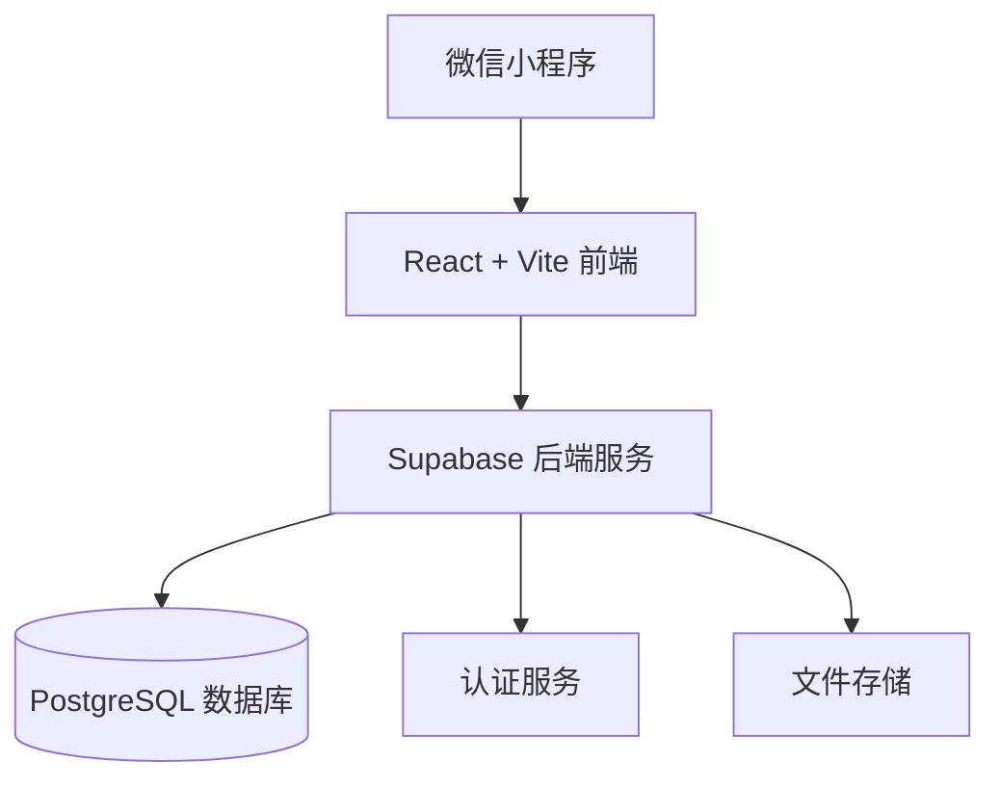
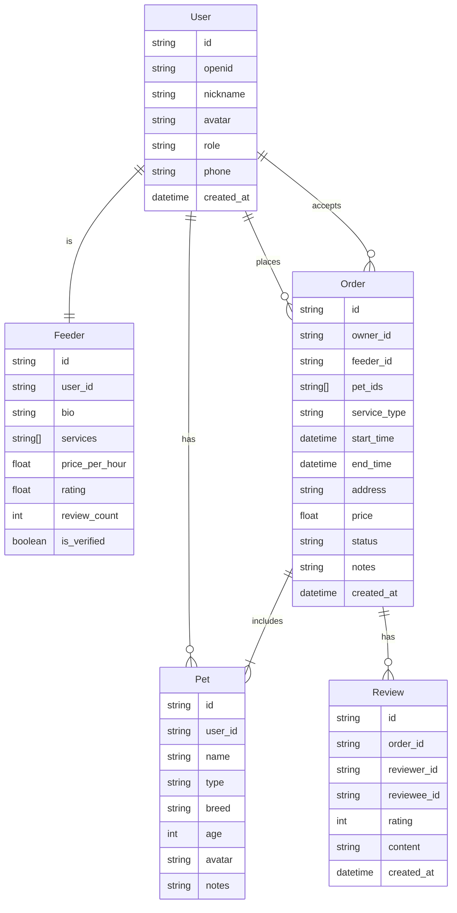

## 1. Architecture Design


## 2. Technology Description
- 前端: React@18 + TypeScript + Vite
- UI 框架: Tailwind CSS
- 状态管理: Zustand
- 后端: Supabase (提供数据库、认证、存储)
- 小程序框架: Taro (支持多端小程序开发)

## 3. Route Definitions
| Route | Purpose |
|-------|---------|
| / | 首页 - 服务推荐和喂养师列表 |
| /publish | 发布需求 - 填写服务需求 |
| /feeder/:id | 喂养师详情 - 查看喂养师信息 |
| /orders | 订单管理 - 订单列表 |
| /order/:id | 订单详情 - 查看订单状态 |
| /profile | 我的 - 个人中心 |

## 4. API Definitions
使用 Supabase Client SDK 进行数据操作，主要数据类型如下：

```typescript
interface User {
  id: string;
  openid: string;
  nickname: string;
  avatar: string;
  role: 'owner' | 'feeder';
  phone?: string;
  created_at: string;
}

interface Pet {
  id: string;
  user_id: string;
  name: string;
  type: 'dog' | 'cat' | 'other';
  breed: string;
  age: number;
  avatar?: string;
  notes?: string;
}

interface Feeder {
  id: string;
  user_id: string;
  bio: string;
  services: string[];
  price_per_hour: number;
  rating: number;
  review_count: number;
  is_verified: boolean;
}

interface Order {
  id: string;
  owner_id: string;
  feeder_id: string;
  pet_ids: string[];
  service_type: string;
  start_time: string;
  end_time: string;
  address: string;
  price: number;
  status: 'pending' | 'accepted' | 'in_progress' | 'completed' | 'cancelled';
  notes?: string;
  created_at: string;
}

interface Review {
  id: string;
  order_id: string;
  reviewer_id: string;
  reviewee_id: string;
  rating: number;
  content: string;
  created_at: string;
}
```

## 5. Data Model

### 5.1 Data Model Definition


### 5.2 Data Definition Language
```sql
-- 用户表
CREATE TABLE users (
    id UUID DEFAULT gen_random_uuid() PRIMARY KEY,
    openid TEXT UNIQUE NOT NULL,
    nickname TEXT NOT NULL,
    avatar TEXT,
    role TEXT NOT NULL CHECK (role IN ('owner', 'feeder')),
    phone TEXT,
    created_at TIMESTAMPTZ DEFAULT NOW()
);

-- 宠物表
CREATE TABLE pets (
    id UUID DEFAULT gen_random_uuid() PRIMARY KEY,
    user_id UUID REFERENCES users(id) ON DELETE CASCADE,
    name TEXT NOT NULL,
    type TEXT NOT NULL CHECK (type IN ('dog', 'cat', 'other')),
    breed TEXT,
    age INTEGER,
    avatar TEXT,
    notes TEXT,
    created_at TIMESTAMPTZ DEFAULT NOW()
);

-- 喂养师表
CREATE TABLE feeders (
    id UUID DEFAULT gen_random_uuid() PRIMARY KEY,
    user_id UUID REFERENCES users(id) ON DELETE CASCADE UNIQUE,
    bio TEXT,
    services TEXT[],
    price_per_hour DECIMAL(10,2) DEFAULT 50.00,
    rating DECIMAL(3,2) DEFAULT 5.00,
    review_count INTEGER DEFAULT 0,
    is_verified BOOLEAN DEFAULT FALSE,
    created_at TIMESTAMPTZ DEFAULT NOW()
);

-- 订单表
CREATE TABLE orders (
    id UUID DEFAULT gen_random_uuid() PRIMARY KEY,
    owner_id UUID REFERENCES users(id) ON DELETE CASCADE,
    feeder_id UUID REFERENCES users(id),
    pet_ids UUID[],
    service_type TEXT NOT NULL,
    start_time TIMESTAMPTZ NOT NULL,
    end_time TIMESTAMPTZ NOT NULL,
    address TEXT NOT NULL,
    price DECIMAL(10,2) NOT NULL,
    status TEXT NOT NULL DEFAULT 'pending' CHECK (status IN ('pending', 'accepted', 'in_progress', 'completed', 'cancelled')),
    notes TEXT,
    created_at TIMESTAMPTZ DEFAULT NOW()
);

-- 评价表
CREATE TABLE reviews (
    id UUID DEFAULT gen_random_uuid() PRIMARY KEY,
    order_id UUID REFERENCES orders(id) ON DELETE CASCADE,
    reviewer_id UUID REFERENCES users(id) ON DELETE CASCADE,
    reviewee_id UUID REFERENCES users(id) ON DELETE CASCADE,
    rating INTEGER NOT NULL CHECK (rating BETWEEN 1 AND 5),
    content TEXT,
    created_at TIMESTAMPTZ DEFAULT NOW()
);

-- 创建索引
CREATE INDEX idx_pets_user_id ON pets(user_id);
CREATE INDEX idx_feeders_user_id ON feeders(user_id);
CREATE INDEX idx_orders_owner_id ON orders(owner_id);
CREATE INDEX idx_orders_feeder_id ON orders(feeder_id);
CREATE INDEX idx_orders_status ON orders(status);
CREATE INDEX idx_reviews_order_id ON reviews(order_id);
CREATE INDEX idx_reviews_reviewer_id ON reviews(reviewer_id);
CREATE INDEX idx_reviews_reviewee_id ON reviews(reviewee_id);

-- 启用 RLS
ALTER TABLE users ENABLE ROW LEVEL SECURITY;
ALTER TABLE pets ENABLE ROW LEVEL SECURITY;
ALTER TABLE feeders ENABLE ROW LEVEL SECURITY;
ALTER TABLE orders ENABLE ROW LEVEL SECURITY;
ALTER TABLE reviews ENABLE ROW LEVEL SECURITY;

-- 设置权限
GRANT SELECT ON users TO anon, authenticated;
GRANT INSERT, UPDATE ON users TO authenticated;
GRANT ALL PRIVILEGES ON pets TO authenticated;
GRANT SELECT ON feeders TO anon, authenticated;
GRANT INSERT, UPDATE ON feeders TO authenticated;
GRANT ALL PRIVILEGES ON orders TO authenticated;
GRANT ALL PRIVILEGES ON reviews TO authenticated;
