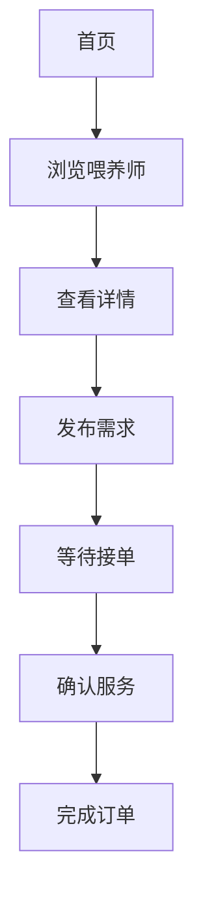

## 1. Product Overview
宠物上门喂养微信小程序，为宠物主人提供便捷的上门喂养服务，解决出差、旅行期间宠物无人照料的问题。
- 连接宠物主人和喂养师，提供安全、可靠的上门喂养服务
- 目标用户：养宠人士、兼职喂养师

## 2. Core Features

### 2.1 User Roles
| Role | Registration Method | Core Permissions |
|------|---------------------|------------------|
| 宠物主人 | 微信授权 | 发布需求、预约服务、查看订单 |
| 喂养师 | 微信授权+认证 | 接收订单、服务管理、收益查看 |

### 2.2 Feature Module
1. **首页**: 服务推荐、喂养师列表、快捷入口
2. **发布需求**: 填写宠物信息、服务要求、时间地点
3. **喂养师详情**: 个人资料、服务评价、服务项目
4. **订单管理**: 订单列表、订单详情、状态跟踪
5. **我的**: 个人中心、我的宠物、设置

### 2.3 Page Details
| Page Name | Module Name | Feature description |
|-----------|-------------|---------------------|
| 首页 | 服务推荐 | 热门服务、附近喂养师、快捷入口 |
| 发布需求 | 表单填写 | 宠物信息、服务时间、地点、特殊要求 |
| 喂养师详情 | 个人资料 | 头像、简介、服务项目、评价列表 |
| 订单管理 | 订单列表 | 全部订单、待接单、进行中、已完成 |
| 我的 | 个人中心 | 用户信息、我的宠物、我的订单、设置 |

## 3. Core Process
宠物主人浏览喂养师→选择喂养师→发布需求→等待接单→确认服务→完成订单

## 4. User Interface Design
### 4.1 Design Style
- 主色调：温暖的橙色 (#FF9D5C) 搭配柔和的米色 (#FFF9F0)
- 按钮风格：圆角矩形，微渐变效果
- 字体：使用圆润可爱的字体，标题 20px，正文 14px
- 布局风格：卡片式布局，简洁温馨
- 图标风格：可爱的线条图标，搭配宠物元素

### 4.2 Page Design Overview
| Page Name | Module Name | UI Elements |
|-----------|-------------|-------------|
| 首页 | 服务推荐 | 顶部banner、分类图标、喂养师卡片列表 |
| 发布需求 | 表单填写 | 分步表单、宠物信息卡片、时间选择器 |
| 喂养师详情 | 个人资料 | 顶部信息栏、服务介绍、评价列表 |
| 订单管理 | 订单列表 | 标签切换、订单卡片、状态标签 |
| 我的 | 个人中心 | 头像信息、功能菜单、快捷入口 |

### 4.3 Responsiveness
- 移动优先设计，适配各种手机屏幕
- 触摸优化，按钮最小 44px，易于点击
- 响应式布局，自动适应不同屏幕尺寸

### 4.4 3D Scene Guidance
不适用3D场景
